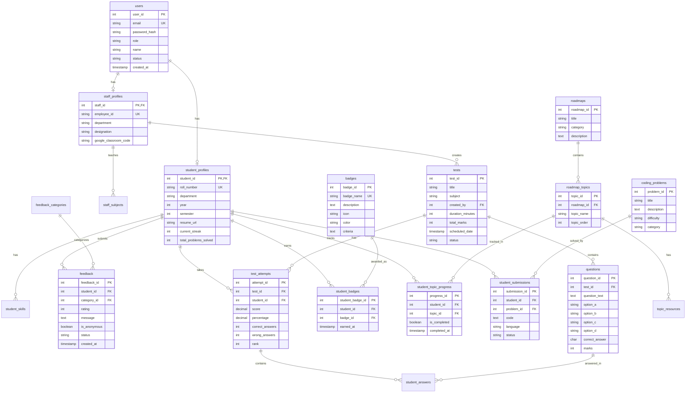

# Entity-Relationship Diagram

## Student Feedback & Learning Management System



---

## Relationship Summary

### One-to-One Relationships
- `users` ↔ `student_profiles` (One user can have one student profile)
- `users` ↔ `staff_profiles` (One user can have one staff profile)

### One-to-Many Relationships
- `student_profiles` → `student_skills` (One student has many skills)
- `student_profiles` → `feedback` (One student submits many feedbacks)
- `student_profiles` → `test_attempts` (One student takes many tests)
- `student_profiles` → `student_badges` (One student earns many badges)
- `staff_profiles` → `tests` (One staff creates many tests)
- `tests` → `questions` (One test has many questions)
- `tests` → `test_attempts` (One test has many attempts)
- `roadmaps` → `roadmap_topics` (One roadmap has many topics)
- `roadmap_topics` → `topic_resources` (One topic has many resources)

### Many-to-Many Relationships (via junction tables)
- `students` ↔ `badges` (via `student_badges`)
- `students` ↔ `roadmap_topics` (via `student_topic_progress`)
- `test_attempts` ↔ `questions` (via `student_answers`)

---

## Key Design Patterns

### 1. Role-Based Access Control
```
users.role → determines profile type
  ├─ student → student_profiles
  ├─ staff → staff_profiles
  └─ admin → no specific profile
```

### 2. Anonymous Feedback with Tracing
```
feedback.is_anonymous = true
  └─ Admin can still see feedback.student_id for tracing
```

### 3. Test Result Tracking
```
test → questions
  └─ test_attempt → student_answers
      └─ Links to specific questions
```

### 4. Learning Path Progression
```
roadmap → roadmap_topics → topic_resources
  └─ student_topic_progress tracks completion
```

### 5. Gamification System
```
badges (predefined achievements)
  └─ student_badges (earned by students)
      └─ Triggered by specific criteria
```

---

## Cardinality Notation

- `||` : Exactly one
- `|o` : Zero or one
- `}{` : One or more
- `}o` : Zero or more

---

## Database Normalization

The schema follows **Third Normal Form (3NF)**:

1. **1NF**: All columns contain atomic values
2. **2NF**: No partial dependencies (all non-key attributes depend on entire primary key)
3. **3NF**: No transitive dependencies (non-key attributes don't depend on other non-key attributes)

### Example of Normalization:
Instead of storing all user data in one table, we split into:
- `users` (authentication data)
- `student_profiles` (student-specific data)
- `staff_profiles` (staff-specific data)

This eliminates redundancy and improves data integrity.

---

## Indexes Strategy

### Primary Indexes (Automatic)
- All `PRIMARY KEY` constraints create indexes

### Foreign Key Indexes
- All `FOREIGN KEY` columns have indexes for join performance

### Search Indexes
- `users.email` - For login queries
- `feedback.created_at DESC` - For recent feedback
- `test_attempts.score DESC` - For leaderboards

### Composite Indexes (Future optimization)
```sql
-- Example: For finding student's test results
CREATE INDEX idx_attempts_student_test ON test_attempts(student_id, test_id);

-- Example: For filtering feedback by status and date
CREATE INDEX idx_feedback_status_date ON feedback(status, created_at DESC);
```

---

## Data Integrity Constraints

### CHECK Constraints
- `users.role` ∈ {student, staff, admin}
- `feedback.rating` ∈ [1, 5]
- `student_profiles.year` ∈ [1, 4]
- `questions.correct_answer` ∈ {A, B, C, D}

### UNIQUE Constraints
- `users.email`
- `student_profiles.roll_number`
- `staff_profiles.employee_id`
- `(test_id, student_id)` in `test_attempts`

### CASCADE Rules
- `ON DELETE CASCADE` - Child records deleted when parent is deleted
- Used for maintaining referential integrity

---

## Performance Considerations

### Query Optimization
1. **Use Views** for complex, frequently-used queries
2. **Index Foreign Keys** for faster joins
3. **Partition Large Tables** (e.g., `test_attempts` by year)
4. **Use EXPLAIN ANALYZE** to identify slow queries

### Scaling Strategies
1. **Read Replicas** for read-heavy operations
2. **Connection Pooling** (HikariCP in Spring Boot)
3. **Caching** (Redis for frequently accessed data)
4. **Archiving** old test results to separate tables

---

This ER diagram represents a **production-ready** database schema for a comprehensive learning management system.
